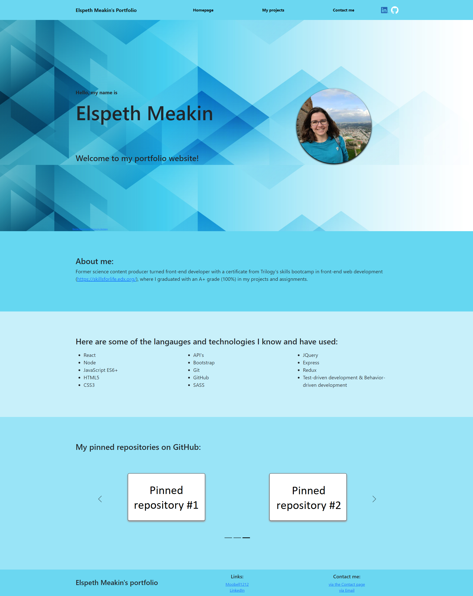
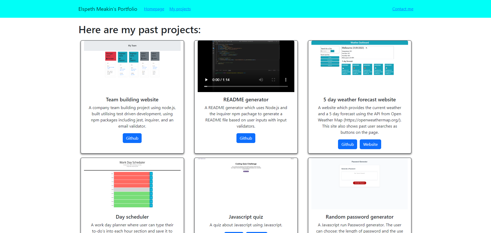
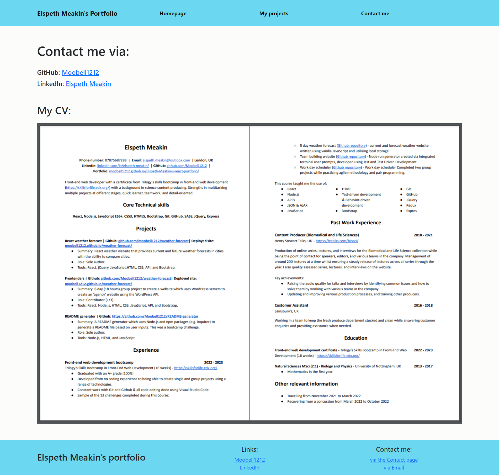

# Elspeth Meakin's React Portfolio
<div align="center" id="top">
</br>

[](https://github.com/Moobell1212/Elspeth-Meakin-s-react-portfolio/graphs/contributors)
[](https://github.com/Moobell1212/Elspeth-Meakin-s-react-portfolio/forks)
[](https://github.com/Moobell1212/Elspeth-Meakin-s-react-portfolio/stargazers)
[](https://github.com/Moobell1212/Elspeth-Meakin-s-react-portfolio/issues)

</br>

[](https://skillicons.dev)
</div>
</br>

## Description
This is portfolio built using React, built maingly using API calls from GitHub. It contains a homepage, a projects page, and a contacts page. The navigation bar and footer is rendered to each page.

The homepage contains:
- A welcome message.
- Information about me and what technologies I know and use.
- A carousel showing the pinned repositories from my GitHub profile.

The projects page contains:
- A highlighted selection of my past projects .
- All the repositories on my GitHub with sorting options.

The contacts page contains:
- Links to my GitHub and LinkedIn.
- A linked photo to a PDF version of my CV.

</br>

Deployed site: https://moobell1212.github.io/Elspeth-Meakin-s-react-portfolio/

## Table of contents
- [Usage](#usage)
- [Installation](#installation)
- [Contributing](#contributing)
- [License](#license)
- [Tests](#tests)
- [Questions](#questions)
- [Acknowledgments](#questions)

## Usage
- The header and footer renders to every page. The header contains animated links to the other pages on the portfolio, and icon links to my GitHub and LinkedIn. The footer contains links to my GitHub profile and LinkedIn account, and links to contact me via the contact page and email.

- The homepage contains:
    - A banner containing:
        - A letter by letter rendered message
        - My name
        - A welcome message
        - The profile photo from my GitHub profile (from a GitHub API call)
    - More information about me
    - The list of technologies I know and use.
    - A carousel containing the pinned repositories from my GitHub profile (generated from a GitHub API).

</br>


</br>

- The project page contains:

    - A highlighted selection of my past projects (from a JSON file) formed of boostrap cards containing:
        - The project title 
        - A gif or screenshot of the application
        - Information on the project
        - A animated button link to the deployed website (when applicable)
        - A animated button link to the GitHub repository

    - Bootstrap cards containing all the repositories on my GitHub using the GitHub API call containing:
        - The project title 
        - The GitHub repository description of the project
        - Dates that the repository was last updated, last pushed, and created.
        - A link to the deployed website (when applicable)
        - A link to the GitHub repository

    - Animated filter buttons for the GitHub repositories for the date they are created, the date they were last updated, and the date they were last pushed.

</br>


</br>

- The contact page contains:
    - Contact information (GitHub and LinkedIn).
    - A linked picture to a PDF download of my CV.

</br>


</br>

Deployed site: https://moobell1212.github.io/Elspeth-Meakin-s-react-portfolio/

<p align="right">(<a href="#top">back to top</a>)</p>

## Installation

To install, on the terminal type:
```
git clone git@github.com:Moobell1212/Elspeth-Meakin-s-react-portfolio.git
```

Install the NPM packages writing the below in the terminal:
```
npm install
```
<p align="right">(<a href="#top">back to top</a>)</p>

## License

None

<p align="right">(<a href="#top">back to top</a>)</p>

## Contributing
If you have any suggestions for improoving this project:
<ol>
<li>Fork the project</li>
<li>Create your branch</li>
<li>Commit your changes</li>
<li>Push your code to the branch</li>
<li>Create a pull request in the repository</li>
</ol>

Any contributions you make are greatly appreciated.

<p align="right">(<a href="#top">back to top</a>)</p>

## Tests
None

<p align="right">(<a href="#top">back to top</a>)</p>

## Questions
Contact the developer with any questions at the GitHub repository: [Moobell1212](https://github.com/Moobell1212).

<p align="right">(<a href="#top">back to top</a>)</p>

## Acknowledgments
- [Img Shields](https://shields.io)
- [GitHub Pages](https://pages.github.com)
- [Skill Icons](https://skillicons.dev/)
- [react-gh-pages](https://github.com/gitname/react-gh-pages)
- [gh-pinned-repos](https://github.com/egoist/gh-pinned-repos)

<p align="right">(<a href="#top">back to top</a>)</p>
