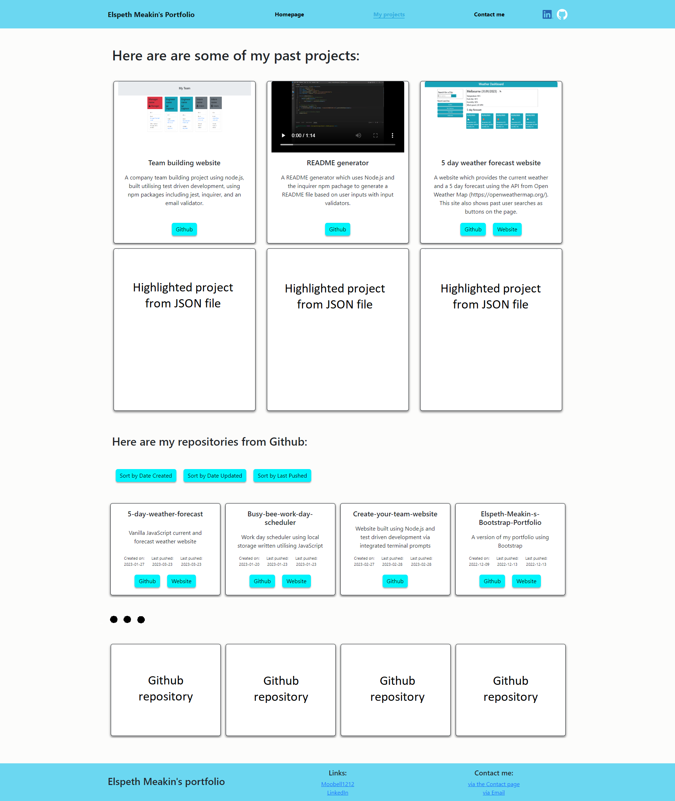
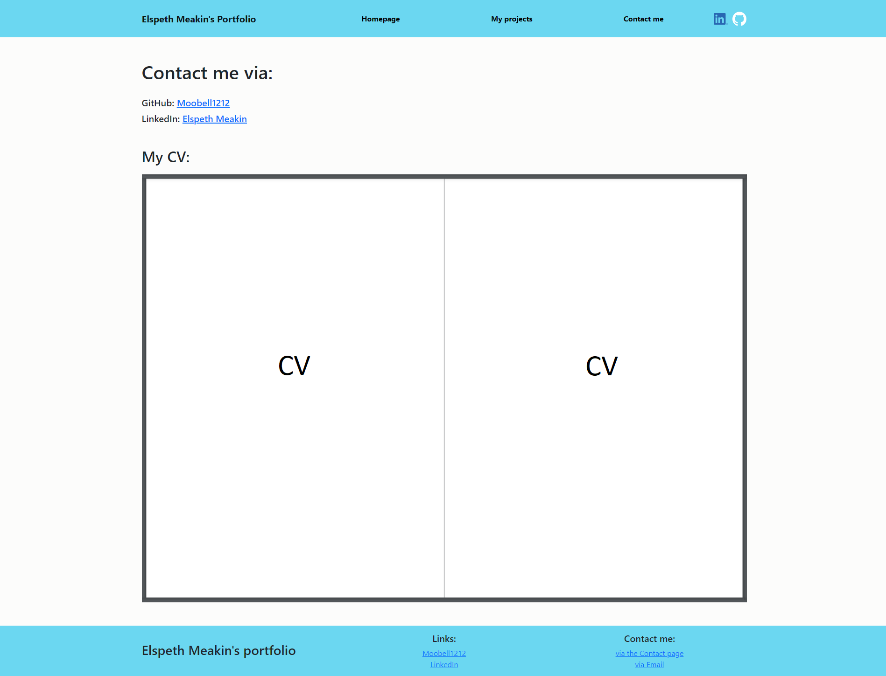

# Elspeth Meakin's React Portfolio
<div align="center">
</br>

[](https://github.com/Moobell1212/Elspeth-Meakin-s-react-portfolio/graphs/contributors)
[](https://github.com/Moobell1212/Elspeth-Meakin-s-react-portfolio/forks)
[](https://github.com/Moobell1212/Elspeth-Meakin-s-react-portfolio/stargazers)
[](https://github.com/Moobell1212/Elspeth-Meakin-s-react-portfolio/issues)

</br>

[](https://skillicons.dev)
</div>
</br>

## Description
This is portfolio built using the React javascript library. It contains a homepage, a projects page, and a contacts page.

The homepage contains:
- My Name
- My avatar
- More information about me

The projects page contains:
- A selection of my past projects
- The project title and information
- A link to the deployed website (when applicable)
- A link to the GitHub repository
- A gif of screenshot of the application

The contacts page contains:
- A contact form
- My email address
- A link to my GitHub profile
- A link to my LinkedIn page
- A link to a PDF version of your CV

This project is still in development.

## Table of contents
- [Usage](#usage)
- [Installation](#installation)
- [Contributing](#contributing)
- [License](#license)
- [Tests](#tests)
- [Questions](#questions)

## Usage
This website will contai:

- A header and footer on every page. The header contains clickable links to the other pages on the portfolio. The footer contains links to my GitHub profile and LinkedIn account.
<br></br>

<br></br>
- A project page containing bootstrap cards with a selecton of past projects. This is shown in a normal and zoomed out screenshot below.
<br></br>

<br></br>

<br></br>

- A contact page shown in a normal and zoomed out screenshot below.
<br></br>

<br></br>


Deployed site: https://moobell1212.github.io/Elspeth-Meakin-s-react-portfolio/

## Installation

To install, on the terminal type:
```
git clone git@github.com:Moobell1212/Elspeth-Meakin-s-react-portfolio.git
```

Install the NPM packages writing the below in the terminal:
```
npm install
```

## License

None

## Contributing
If there are any suggestions for improoving this README generator:
<ol>
<li>Fork the project</li>
<li>Create your branch</li>
<li>Commit your changes</li>
<li>Push your code to the branch</li>
<li>Create a pull request in the repository</li>
</ol>

## Tests
None

## Questions
Contact the developer with any questions at the GitHub repository: [Moobell1212](https://github.com/Moobell1212).
